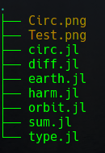
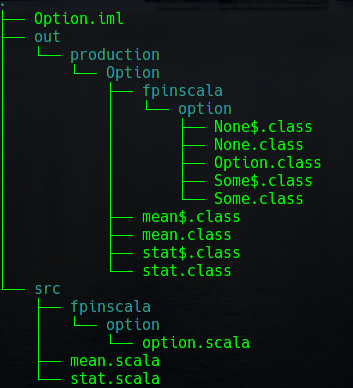
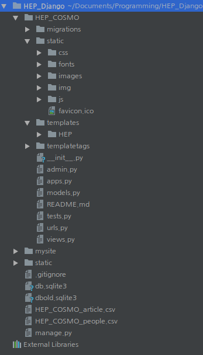

<!--page_number: true-->

<h1 style="text-align:center">Basic Framework for Programming</h1>
===
<h2 style="text-align:center">build, src, test, run and IDE</h2>

 

<b><a href="https://geodphys.blogspot.kr">Tae Geun Kim</a></b>

---

<h2 style="text-align:center">What is FrameWork?</h2>

---

## What is Framework?

* 소프트웨어 프레임워크(software framework)는 복잡한 문제를 해결하거나 서술하는 데 사용되는 기본 개념 구조이다. 간단히 뼈대, 골조(骨組), 프레임워크(framework)라고도 한다. 이렇게 매우 폭넓은 정의는 이 용어를 버즈워드(buzzword)로서, 특히 소프트웨어 환경에서 사용할 수 있게 만들어 준다. (<i><a href="https://ko.wikipedia.org/wiki/%EC%86%8C%ED%94%84%ED%8A%B8%EC%9B%A8%EC%96%B4_%ED%94%84%EB%A0%88%EC%9E%84%EC%9B%8C%ED%81%AC">Wikipedia</a></i>)

* 요약하자면, 프로그램을 구성하는 기본적인 구조를 의미한다. (혹은 규칙이라 이해하는 것이 편할 수도 있다.)

---

<h2 style="text-align:center">Why do we need framework?</h2>

---

<h2 style="text-align:center">Compare these!</h2>

<link rel="stylesheet" type="text/css" href="frame.css">

    

    

    

    

    

    

---

## Why do we need Framework?

* 그냥 코드의 나열은 무엇을 의미하는지 전혀 알 수 없다.
* Compiler가 필요한 언어일 경우, Framework가 없다면 Compiler는 프로그램의 구조를 이해할 수 없다.
* 프로젝트가 커질수록 파일들이 많아질텐데 규칙이 지정되어 있지 않다면 매우 힘들어질 것이다.
* 프로그램을 배포하기 위해서는 빌드가 가능하게 만들어야 하므로 규칙이 필요하다.

---

<h2 style="text-align:center">Example of Framework</h2>

---
### 1. Build Framework

* SBT Framework (Scala, Java, Kotlin)
* CMake Framework (C, C++)
* Maven Framework (Java)

### 2. Web Framework

* Django Framework (Python)
* Flask Framework (Python)
* Spring Framework (Java)
* Play Framework (Scala)
* JS - Angular, React, Vue, etc.
* Ruby On Rails (Ruby)
* Beego (Go)

---

### Example - Django

    

    

    

    

    <ul>
    <li>HTML, CSS, JS로 구성된 복잡한 웹페이지를 정리</li>
    <li>Python이 반응 및 구현을 담당</li>
    <li>프론트와 백엔드를 동시에 구현</li>
    <li>admin 페이지가 상당히 잘 되어 있어서 한 번 구현해놓으면 코딩이 필요없을 정도</li>
    <li>Django + Bootstrap은 엄청난 시너지효과를 냄 (<a href="http://nexus.yonsei.ac.kr">Yonsei HEP-COSMO</a>)</li>
    </ul>
    

---

<h2 style="text-align:center">Introduce Basic Framework</h2>

---

## Introduce Basic Framework

* 기본 프로젝트 디렉토리는 다음과 같이 구성

	* Project
		* src
		* test
		* main

* src : 소스파일을 담는 곳 (Class 및 Method)
* test : 테스트 파일을 담는 곳
* main : 실행파일을 담는 곳

---

하지만, 이런 것을 일일이 Control하는 것은 너무 어렵고 번거로움. 
따라서 자동화된 환경이 필요! $\Rightarrow$ IDE!

	
    
    
    
    
    
    

    
    

---

<h2 style="text-align:center">Integrated Development Environment</h2>

---

## What is IDE?

* 통합 개발 환경(統合開発環境, Integrated Development Environment, IDE)은 코딩, 디버그, 컴파일, 배포 등 프로그램 개발에 관련된 모든 작업을 하나의 프로그램 안에서 처리하는 환경을 제공하는 소프트웨어이다. 종래의 소프트웨어 개발에서는 컴파일러, 텍스트 편집기, 디버거 등을 따로 사용했다. 이러한 프로그램들을 하나로 묶어 대화형 인터페이스를 제공한 것이 통합 개발 환경이다. 최근의 통합 개발 환경(IDE)은 그래픽 사용자 인터페이스(GUI) 응용 프로그램 개발용 고속 개발 도구가 많다. (<i><a href="https://ko.wikipedia.org/wiki/%ED%86%B5%ED%95%A9_%EA%B0%9C%EB%B0%9C_%ED%99%98%EA%B2%BD">Wikipedia</a></i>)
* Text Editor와 반대에 있는 개념 (Vim, Emacs, Nano, Atom, VSCode, Sublime text editor, Bracket 등등)

---

## IDE 종류

언어 | IDE 
:--: | :--:
Python | PyCharm, Spyder, Pydev(Eclipse), Wing IDE, Geany, Eric, Jupyter
R | RStudio
Java | IntelliJ IDEA, Eclipse, NetBeans, XCode, KDevelop, Anjuta, BlueJ
Scala | IntelliJ IDEA, Scala IDE(Eclipse)
Kotlin | IntelliJ IDE, Android Studio
C/C++ | Visual Studio, KDevelop, CLion
Julia | Juno (Atom)

---

## Advantage of IDE

* IntelliSense is incredibly useful.
* Integrated Code Organization and Navigation
* Integrated Testing
* Integrated Debugging 
* If not, Java become terrible!

---

## But..

* IDE는 항상 좋은 것만은 아님 (무거움)
따라서 Python 같은 가벼운 스크립트 언어에 굳이 IDE를 쓸 필요는 없음. 물론 시각화가 용이하거나 Workspace를 지원해주는 Spyder의 경우 매우 유용하긴함.
* 지나친 IDE 사용은 닭 잡는데 소 잡는 칼을 쓰는 것과 같은 결과를 낳음. 괜히 git 용량을 늘리는 등 단순한 계산 프로그램을 구현할 때는 굳이 쓸 필요가 없음. 이럴 땐 Text Editor를 사용!

---

## Tips

* IDE는 보통 무료이나 JetBrains 제품들이나 간혹 유료 제품들이 나옴. 물론 Community Edition을 사용하면 공짜!
* 보통 대학 메일을 가지고 있으면 학생은 공짜로 사용할 수 있는 제품들이 많음. (JetBrains  및 Visual Studio 가 특히!)
* 일단 언어를 배울 때는 IDE 사용을 지양하다가 좀 익숙해지고 규모가 커진다면 IDE 사용을 권함.
