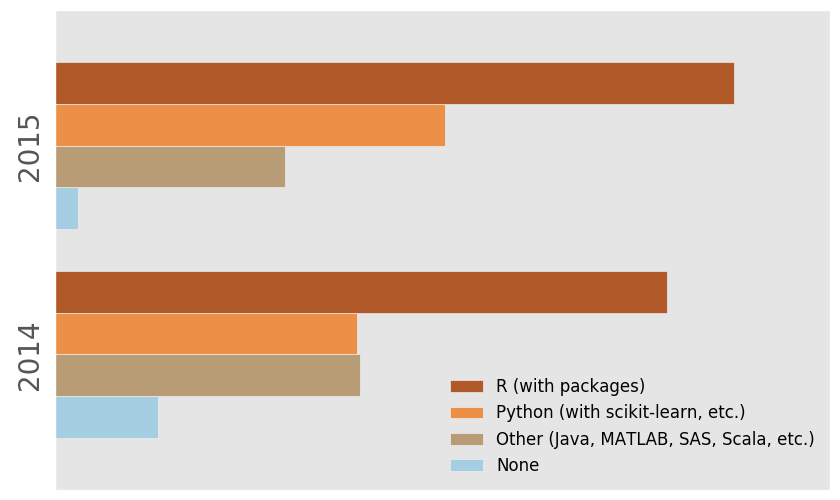
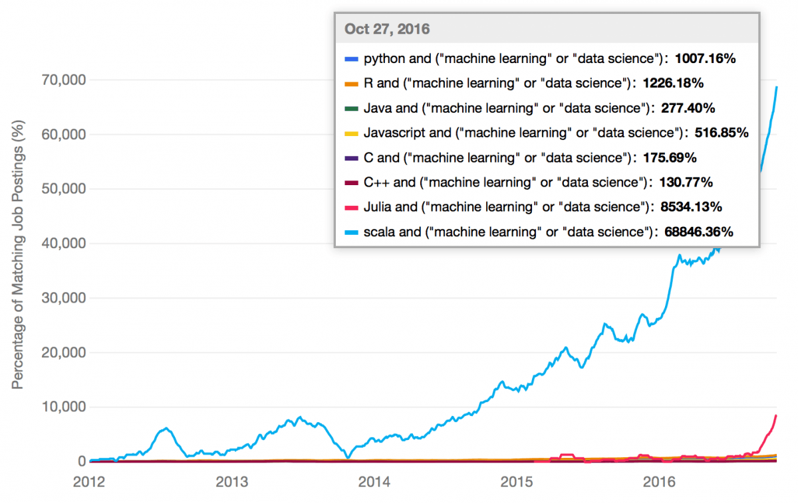

<!-- $theme: default -->
<!-- $size: 4:3 -->
<!-- page_number: true -->

<h1 style="text-align:center"> PL 2017 Winter</h1>
===
<h3 style="text-align:center">Introduce Machine Learning</h3>
 

Provided by <b>Tae Geun Kim</b>

---

## Meaning of Machine Learning

: 기계 학습(機械學習) 또는 머신 러닝(영어: machine learning)은 인공 지능의 한 분야로, 컴퓨터가 학습할 수 있도록 하는 알고리즘과 기술을 개발하는 분야를 말한다. 가령, 기계 학습을 통해서 수신한 이메일이 스팸인지 아닌지를 구분할 수 있도록 훈련할 수 있다. 
&nbsp;&nbsp; 기계 학습의 핵심은 표현(representation)과 일반화(generalization)에 있다. 표현이란 데이터의 평가이며, 일반화란 아직 알 수 없는 데이터에 대한 처리이다. 이는 전산 학습 이론 분야이기도 하다. 다양한 기계 학습의 응용이 존재한다. 문자 인식은 이를 이용한 가장 잘 알려진 사례이다.

---

## History of Machine Learning

* 1946 : ENIAC 발명 - Von Neumann
* 1950 : Alan Turing - Turing Test
* 1952 : Arthur Samuel - 체커 게임 인공지능 개발
* 1956 : Artificial Intelligence 용어 사용 제안
* 1958 : Frank Rosenblatt - Perceptron 설계 (최초의 인공신경망)
* 1967 : Cover & Hart - KNN 발명
* 1979 : 스탠포드 학생들이 최초의 자율로봇인 스탠포드 카트 제작
* 1981 : Explanation-Based Learning 도입
* 1985 : Backpropagation 알고리즘 재발견 $\rightarrow$ Hidden Layer
* 1990 : SVM 소개
---

* 1997 : IBM DeepBlue 체스챔피언에게 승리
* 2006 : 빅데이터, 빠른 컴퓨팅으로 ML의 상업화 진행
* 2011 : IBM Watson 컴퓨터가 Jeopardy TV프로그램 우승
* 2012 : Jeff Dean, Andrew Ng - Google Brain Project 시작
* 2012 : Geoffrey Hinton - Deep Neural Network 사용
* 2013 : DeepMind - Atari 게임에서 강화학습으로 인간을 이김
* 2014 : Facebook - DeepFace DNN 개발
* 2014 : Google - DeepMind 인수
* 2015 : Amazon - Amazon Machine Learning 출시
* 2016 : MS - CNTK 출시
* 2016 : Google - AlphaGo가 이세돌에게 승리
* 2017 : Google - TensorFlow 발표
---
## How to study Machine Learning

### - Prerequisite
* **Probability Theory & Statistics**
* Calculus
* Linear Algebra
* Optimization (Numerical Analysis)
* Discrete Mathematics

### - Optinal

* Analysis
* Measure Theory
* Statistical Physics

---
### - Programming Languages

---

---

---

### R

**Pros**
* 어마어마한 통계 패키지의 수 (거의 모든 통계패키지)
* 설치가 가벼우며 내장 통계함수들이 존재
* 행렬 연산이 꽤... 쓸만함
* 시각화도 쉬움

**Cons**
* 성능이 매우 느리다.
* 분야 특화 언어로 범용 프로그래밍에 부적합
* 이상한 문법 구조를 지니고 있다.

---

### Python

**Pros**
* 가장 많이 쓰이는 언어 중 하나
* 배우기 매우 쉽다.
* Machine Learning을 위한 패키지가 아주 잘 되어 있다.
	(Numpy, Pandas, Tensorflow, Scikit-learn)

**Cons**
* 타입 안정성 (동적 언어이므로)
* R의 통계적 범주를 따라가지 못한다. 또한 범용 언어로서 느리다.

---

### Java

**Pros**
* 모든 곳에 쓰임. 자바로 적히지 않은 프로그램은 거의 없다.
* 강타입언어로 타입안정성 보장
* 고성능, 범용, 컴파일 언어.

**Cons**
* 문법이.. 아무래도 생산성이 떨어진다.
* 분야 특화 언어인 R과 비교했을 때, 라이브러리가 매우 적다.

---

### Scala

**Pros**
* Scala + Spark = 고성능분산컴퓨팅.
* 다중패러다임 - 객체지향 + 함수형
* JVM 위에서 돌아가면서 자바의 모든 기능을 쓸 수 있다.

**Cons**
* Learning Curve가 가파르다.

---

### Julia

**Pros**
* JIT 컴파일러 - 동적이며 동시에 고성능이다.
* 수치해석에 특화된 언어이면서 범용도 가능
* 가독성이 높다.

**Cons**
* 아직 만든지 얼마 되지 않아 패키지의 안정성이 부족하다.
* 커뮤니티가 작아 패키지가 제한되어 있다.

---

### MATLAB

**Pros**
* 수치계산에 특화된 언어이다.
* 데이터 시각화가 매우 잘 되어 있다.
* 과학, 공학 쪽에서 자주 사용된다.

**Cons**
* 공짜가 아니다.
* 범용 프로그래밍 언어가 아니다.

---

### Summary

* R: 통계프로그래밍의 1인자.
* Python: 훌륭한 올라운더.
* Java: 위의 언어들을 할 수 있다면 아주 좋은 고성능 언어.
* Scala: 빅데이터를 다루기 위한 완벽한 언어.
* Julia: 미래에 부상할 언어.
* MATLAB: 수치적 프로그래밍에 최고인 언어.

**Reference**
- [Free Code Camp](https://medium.freecodecamp.org/which-languages-should-you-learn-for-data-science-e806ba55a81f)

---
## ML Frameworks

* Ref : [IT World](http://www.itworld.co.kr/slideshow/106090)
	* **HW # 2** : 정리하시오! 
---

## Additional Slides

**- Reference**

* socurites@aidentify.io
* [서울대학교 바이오지능연구실](bhkim@bu.snu.ac.kr)
