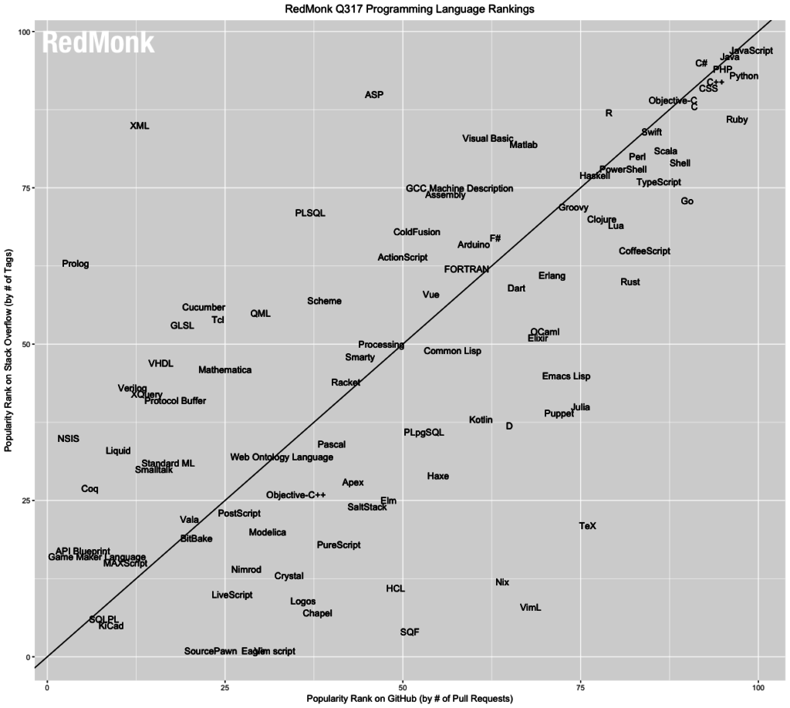
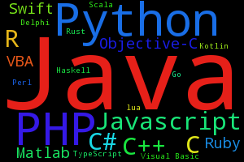
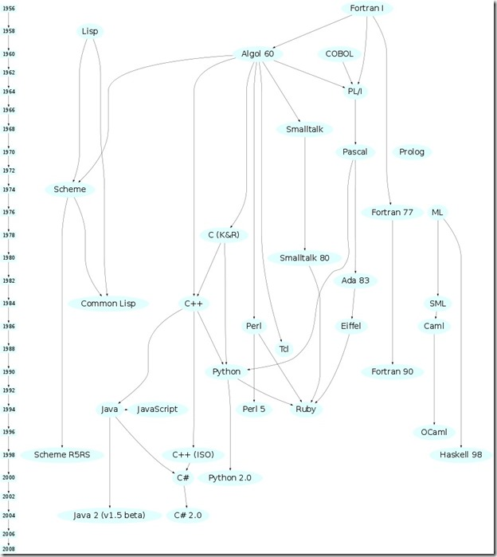
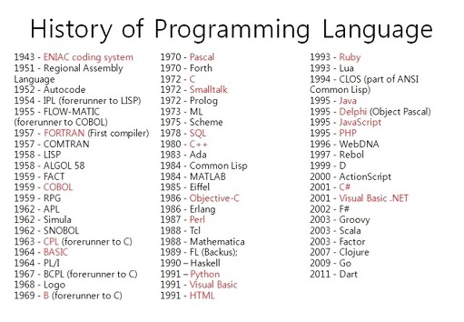

<!-- $theme: default -->
<!-- $size: 4:3 -->
<!-- page_number: true -->

<h1 style="text-align:center"> PL 2017 Winter</h1>
===
<h3 style="text-align:center">Programming Languages 
& Algorithms</h2>
 

Provided by <b>Tae Geun Kim</b>

---
## Programming Languages

 

* What's the most popular programming languages?

	* [TIOBE Index](https://www.tiobe.com/tiobe-index/)
	* [Redmonk](http://redmonk.com/sogrady/category/programming-languages/)
	* [Slant](https://www.slant.co/topics/5984/~productivity-enhancing-well-designed-and-concise-rather-than-just-popular-or-time-tested-programming-la)
	* [PYPL](http://pypl.github.io/PYPL.html)

---

---
## Classification - 1. Uses

* **Major Languages** - Java, JS, C/C++, C#, Python
* **Grow Languages** - Swift, Scala, Go, Rust, F#, Kotlin
* **DSL** - R, Matlab, TeX, Mathematica, SQL
* **Dead** - FORTRAN, Scheme, LISP, Objective-C
* **Base** - Assembly
---

---
## Classification - 2. Type

* **Procedural** - C, D, FORTRAN, ALGOL
* **Object-Oriented** - Java, C++, C#, Go, Rust
* **Functional** - Haskell, Elixir, Racket, Clojure
* **Multi-Paradigm** - Scala, F#, Julia, Swift, Python
---
### Programming Pradigm

* 명령형 프로그래밍(imperative programming)
	>명령형 프로그래밍은 문제를 해결하는 절차를 기술하는 방식의 프로그램의 스타일. 프로그램은 수행할 명령어들로 구성. 명령어들은 주로 프로그램의 상태를 변경함

* 함수형 프로그래밍(functional programming)
	> 프로그램의 계산 과정을 수학 함수의 수행으로 간주하는 프로그래밍 스타일. 프로그램은 함수의 정의들로 구성됨. 함수 수행은 부수 효과를 허용하지 않는다. (함수의 부수효과란 상태변경, 데이터 수정을 의미한다)

---
* 논리 프로그래밍(logic programming)
	> 정형 논리를 기반으로 한 프로그래밍 스타일. 프로그램은 문제에 대한 사실 혹은 규칙을 표현하는 논리 문장들의 집합.
* 객체 지향 프로그래밍(object-oriented programming)
	> 객체개념을 기반으로 하는 프로그래밍 스타일. 객체는 data와 그에대한 연산(프로시저,메소드)들을 포괄하는 개념. 프로그램의 실행은 객체사이의 상호작용에 의해 이뤄짐.
---
### Paradigm Reference

* [Paradigm Introduction](http://melodyonlight.com/?p=374)
* [Paradigm Classifications](http://dodo000.tistory.com/2)
* [Imperative vs Functional](https://github.com/funfunStudy/study/wiki/%EB%AA%85%EB%A0%B9%ED%98%95-%ED%94%84%EB%A1%9C%EA%B7%B8%EB%9E%98%EB%B0%8D%EA%B3%BC-%ED%95%A8%EC%88%98%ED%98%95-%ED%94%84%EB%A1%9C%EA%B7%B8%EB%9E%98%EB%B0%8D-%EB%B9%84%EA%B5%90)

---
## Classification - 3. History

* **Ancienct** - FORTRAN, ALGOL, Cobol, LISP
* **Old** - C, Pascal, Prolog
* **Proper** - C++, Java, Python, Erlang, Haskell
* **Young** - C#, Go, Swift, Rust, Kotlin, Scala, Julia

---

---

---
## For Data Science

* Performance
* Statistics Package
* Visualization
* Readability

---
### Best Performance

1. FORTRAN
2. C++
3. Rust
4. Chapel
5. C#
6. Go
7. Swift
8. Julia
9. Scala
10. Java

---
### Worst Performance

1. Octave
2. R
3. Mathematica
4. Python
5. MATLAB

---
### Performance Reference

* [NASA](https://modelingguru.nasa.gov/docs/DOC-2625)
* [Computer Benchmark Game](http://benchmarksgame.alioth.debian.org/u64q/fasta.html)
* [Julia Benchmark](https://julialang.org/benchmarks/)

---
### Statistical Packages

1. R
2. MATLAB
3. Mathematica
4. Python
5. Julia
6. Scala

---
### Visualization

1. Python
2. Mathematica
3. MATLAB
4. R
5. Julia
6. Scala (Spark, Java)
7. C++ (CERN-ROOT)

---
## Recommended Languages

* DSL - Julia, R
* OOP - C#(Class), Go(Type & Method)
* FP - Haskell(Pure), Scala(FP+OOP), Swift(Impure)
* Web - Python(Django, Flask), Spring, JS
* High Performance - C++
 
> For Data Scientist,
> * Main : R, Julia, Python, Scala
> * Sub : Go, Swift, C++

---
## Homework #1

Submit the report for one language of belows:

* Go
* Swift
* Kotlin
* Haskell

Report should contain belows & should be written in Markdown
* History & Purpose
* Advantange & Disadvantage
* Example Code