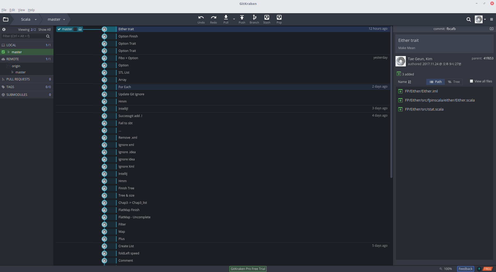

<!--page_number: true-->

<h1 style="text-align:center">Useful Stack - Git & Github</h1>
===

<h2 style="text-align:center">With GitKraken</h2>

<br>

<p style="text-align:center"></p>

<br>
<p style="text-align:center"><b><a href="https://geodphys.blogspot.kr/">Tae Geun Kim</a></b></p>

---

## What is Git?

* <s>리누스 토르발스가 Subversion을 쓰다가 엄청나게 빡쳐서 개발한 분산형 버전 관리 프로그램.</s> 깃(Git)은 프로그램 등의 소스 코드 관리를 위한 분산 버전 관리 시스템이다. 기하학적 불변 이론을 바탕으로 설계됐고, 빠른 수행 속도에 중점을 두고 있는 것이 특징이다. 최초에는 리누스 토르발스가 리눅스 커널 개발에 이용하려고 개발하였으며, 현재는 다른 곳에도 널리 사용되고 있다. (<i><a href="https://ko.wikipedia.org/wiki/%EA%B9%83_(%EC%86%8C%ED%94%84%ED%8A%B8%EC%9B%A8%EC%96%B4)">Wikipedia</a></i>)
* 깃의 작업 폴더는 모두, 전체 기록과 각 기록을 추적할 수 있는 정보를 포함하고 있으며, 완전한 형태의 저장소이다. 네트워크에 접근하거나 중앙 서버에 의존하지 않는다.
* 간단히 말해, 백업 및 버젼관리 시스템.

---

## How to Use Git

1. 처음 사용할 때, (컴퓨터 당 1번)
	```git
	git config --global user.name <Your name or ID>
    git config --global user.email <Your Email>
	```
2. 아무 빈 폴더에 들어가서 다음 명령어를 실행 (폴더 당 1번)
	```git
    git init
    git remote add origin <Your repository link>
    ```
3. 여러 파일들을 만들고 작업 후 다음 명령어 실행
	```git
    git add .
    git commit -am "Log message"
    git push origin master
    ```
4. 앞으로 그 폴더에서는 3번만 반복

---

## What is Github?

* 대표적인 무료 Git 저장소. Git를 호스팅 해주는 Github는 자유 소프트웨어의 성지로 부각되고 있다. 본사는 미국 샌프란시스코에 있다. (<i><a href="https://namu.wiki/w/GitHub">나무위키</a></i>)
* 한국을 포함한 전세계 IT 업계에서는 프로그래머 면접에서 GitHub 계정이 일종의 포트폴리오 역할을 할 수 있기 때문에 관련 업계에서 상당히 각광받는 중. 아예 입사지원서에 GitHub 계정/url을 요구하는 곳도 있고 점점 늘어나는 추세다. 최근에 들어서는 국적을 가리지 않고 스타트업이나 개방적인 기업 중심으로 GitHub를 포토폴리오로 사용 / 기업 활동에 사용하는 일이 점점 늘어나고 있다.

---

## How to Use Github?

1. https://github.com 에 접속한다.
2. 계정을 만들거나 로그인 한다. (Sign up or Sign in)
3. (+) 아이콘을 눌러 Repository를 만든다.
4. 컴퓨터의 작업 폴더에서 (git init이 되어있는 폴더) 앞에 적어놓은 Git 과정의 2번에 Repository 링크를 넣는다.
5. push 까지 마치면 Github에 백업 완료!

---

## Example

```git
git config --global user.name Axect
git config --global user.email edeftg@gmail.com
```
```git
git init
git remote add origin https://github.com/Axect/Scala
```
```git
git add .
git commit -am "Fix ADT problem"
git push origin master
```

---

## But...

* 일일이 타이핑 하는 것은 매우 귀찮다.
* Linux의 경우 매번 아이디 비번 입력하는 것에 진저리가 난다.
* CLI(Command Line Interface)는 너무 딱딱하다.

<br>

## Then...?

<p style="text-align:center"></p>

---

## What is GitKraken?

* Github, Bitbucket, Gitlab 을 위한 GUI Tool
* Commit, Push, Pull 등의 Git 기능이 자동화 되어 있음.
* 예쁨


---



---

## How to Use GitKraken?

* Download: [GitKraken](https://www.gitkraken.com/)
* And Just use it!
	* If you use linux & Can't make desktop file then refer to [GeodPhys Blog](https://geodphys.blogspot.kr)

